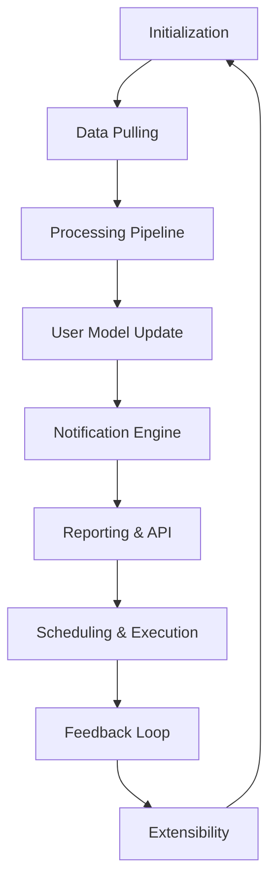

# Workflow of Watchcat

This document outlines the end-to-end workflow of the Watchcat system, aligning with the goals defined in `goal.md`.

## Immature thoughts

- A possibility is to prompt the LLM to think about how the information may interact with what we are interested in (e.g., enabling a new approach to reach our goal) and assess the feasibility and potential impact. We can then filter the results based on relevance, confidence, and importance.

## Overview

TODO: Improve the workflow

## 1. Initialization

- Load configuration (`watchcat.config.toml`) and user settings.
- Initialize the datastore (SQLite) and restore the latest checkpoint.
  - Discover and register available plugins (pullers, processors, notifiers).

## 2. Data Pulling

- For each enabled Data Puller plugin:
  - Connect to the source (e.g., arXiv API, email server, RSS feed).
  - Retrieve new or updated items since the last run.
  - Normalize and tag raw data.
  - Store raw records in the datastore.

## 3. Processing Pipeline

- Trigger the processing pipeline in configured order:
  1. Data cleansing and normalization.
  2. Transformation (e.g., feature extraction, parsing).
  3. Analysis and summarization (NLP models, statistical methods).
  4. Enrichment (e.g., metadata lookup, cross-references).

- Persist processed results and metadata.

## 4. User Model Update

- Analyze processed insights against the current user model.
- Adjust user preferences and interest profiles based on new data and feedback.
  - Save updated model parameters.

## 5. Notification Engine

- Evaluate user-defined rules and thresholds.
- If criteria are met:
  - Generate alerts (emails, desktop notifications, dashboards).
  - Log notifications and schedule follow-ups if needed.

## 6. Reporting & API

- Generate summary reports and visualizations.
  - Expose results via:

  - Command-line interface (CLI) commands.
    - Programmatic API endpoints.

  - Exportable formats (JSON, CSV, HTML).

## 7. Scheduling & Execution

- Support:
  - Real-time mode (event-driven triggers).
  - Scheduled batch mode (cron-style intervals).
  - Manage execution state and retries to ensure reliability.

## 8. Feedback Loop

- Capture user feedback on alerts and summaries.
  - Incorporate feedback into the user model and future processing.

## 9. Extensibility

- Allow dynamic loading of new plugins:
  - Data Pullers
  - Processors
  - Notification strategies
  - Provide interfaces and guidelines for plugin development.
